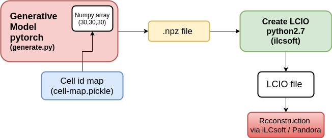

# Generation of showers

We would like to generate showers with our generative models (preferably with GPUs) and create `lcio` files. In this way, we could use `iLCsoft` ecosystem to use these showers for reconstruction and further anaylsis.

## Current plan

