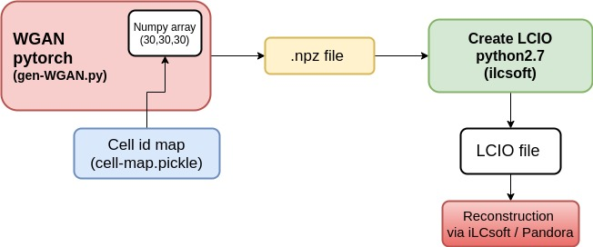

# Generation of showers with WGAN model

We would like to generate WGAN showers (preferably with GPUs) and create `lcio` files. In this way, we could use `iLCsoft` ecosystem to use these showers for reconstruction and further anaylsis.

## Current plan

